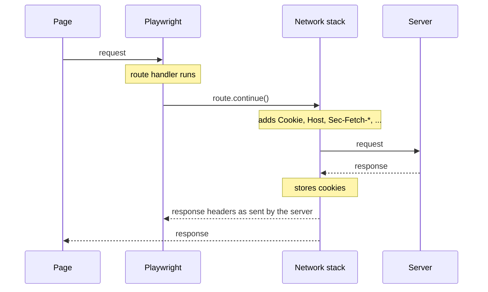

# Network (guide) + Route.abort() / Route.request() / Request.isNavigationRequest() API reference
- URL: https://playwright.dev/docs/network and https://playwright.dev/docs/api/class-route#route-abort and https://playwright.dev/docs/api/class-request#request-is-navigation-request
- Fetched: 2026-09-15
- Source type: official docs (guide + API reference, sourced from microsoft/playwright docs/src/network.md, docs/src/api/class-route.md, docs/src/api/class-request.md on the `main` branch)
- Last updated (if shown): unknown

## GUIDE: Network: Handle requests (page.route / context.route)

```js
await page.route('**/api/fetch_data', route => route.fulfill({
  status: 200,
  body: testData,
}));
await page.goto('https://example.com');
```

```python async
await page.route(
    "**/api/fetch_data",
    lambda route: route.fulfill(status=200, body=test_data))
await page.goto("https://example.com")
```

You can mock API endpoints via handling the network requests in your Playwright script.

### Variations

Set up route on the entire browser context with `browserContext.route()` or page with `page.route()`. It will apply to popup windows and opened links.

```js
await browserContext.route('**/api/login', route => route.fulfill({
  status: 200,
  body: 'accept',
}));
await page.goto('https://example.com');
```

```csharp
await page.RouteAsync("**/api/fetch_data", async route => {
  await route.FulfillAsync(new() { Status = 200, Body = testData });
});
await page.GotoAsync("https://example.com");
```

## Modify requests

```js
// Delete header
await page.route('**/*', async route => {
  const headers = route.request().headers();
  delete headers['x-secret'];
  await route.continue({ headers });
});

// Continue requests as POST.
await page.route('**/*', route => route.continue({ method: 'POST' }));
```

```python async
# Delete header
async def handle_route(route):
    headers = route.request.headers
    del headers["x-secret"]
    await route.continue_(headers=headers)
await page.route("**/*", handle_route)

# Continue requests as POST.
await page.route("**/*", lambda route: route.continue_(method="POST"))
```

You can continue requests with modifications. Example above removes an HTTP header from the outgoing requests.

## Abort requests

You can abort requests using `page.route()` and `route.abort()`.

```js
await page.route('**/*.{png,jpg,jpeg}', route => route.abort());

// Abort based on the request type
await page.route('**/*', route => {
  return route.request().resourceType() === 'image' ? route.abort() : route.continue();
});
```

```java
page.route("**/*.{png,jpg,jpeg}", route -> route.abort());

// Abort based on the request type
page.route("**/*", route -> {
  if ("image".equals(route.request().resourceType()))
    route.abort();
  else
    route.resume();
});
```

```python async
await page.route("**/*.{png,jpg,jpeg}", lambda route: route.abort())

# Abort based on the request type
await page.route("**/*", lambda route: route.abort() if route.request.resource_type == "image" else route.continue_())
```

```csharp
await page.RouteAsync("**/*.{png,jpg,jpeg}", route => route.AbortAsync());

// Abort based on the request type
await page.RouteAsync("**/*", async route => {
if ("image".Equals(route.Request.ResourceType))
    await route.AbortAsync();
else
    await route.ContinueAsync();
});
```

## Modify responses

To modify a response use APIRequestContext to get the original response and then pass the response to `route.fulfill()`. You can override individual fields on the response via options:

```js
await page.route('**/title.html', async route => {
  // Fetch original response.
  const response = await route.fetch();
  // Add a prefix to the title.
  let body = await response.text();
  body = body.replace('<title>', '<title>My prefix:');
  await route.fulfill({
    // Pass all fields from the response.
    response,
    // Override response body.
    body,
    // Force content type to be html.
    headers: {
      ...response.headers(),
      'content-type': 'text/html'
    }
  });
});
```

## How request interception works

Routes sit between the page and the browser's network stack. The handler runs before the network stack has processed the request: `route.continue()` passes it on, `route.fulfill()` answers it without touching the network, and `route.abort()` fails it.



### Headers owned by the network stack

Some headers are attached by the network stack right before the request is sent: `Cookie`, `Host`, `Accept-Encoding`, `Content-Length`, `Sec-Fetch-*` and a few others. This is a security boundary: an `HttpOnly` cookie, for example, is never exposed to the page. Since the route handler runs before that step, these headers are not reliably present in `request.headers()` or `request.allHeaders()`, and they cannot be overridden. A `cookie` header passed to `route.continue()` is ignored in favor of the browser's cookie store.

On the response side the network stack has already done its work, so `response.allHeaders()` returns the headers exactly as the server sent them, including `Set-Cookie` for `HttpOnly` cookies. To see the exact request headers that went over the wire, observe the request without routing it: with no routes installed, `request.allHeaders()` includes all of them.

### Redirects

Playwright treats a request and its redirects as a single unit. The handler is called once, for the original request, and the browser follows the redirect on its own. `response.request()` returns the last request in the chain, and `request.redirectedFrom()` walks it back to the one you intercepted. Headers passed to `route.continue()` apply to every hop of the chain, except `cookie`, which always comes from the cookie store.

Fulfilling with a `3xx` status does not give you a second chance to intercept. Chromium and Firefox follow the redirect without calling your handler, and WebKit rejects the call. To serve different content, fulfill with that content. To send the request elsewhere, pass `url` to `route.continue()` or `route.fallback()`.

## Glob URL patterns

Playwright uses simplified glob patterns for URL matching in network interception methods like `page.route()` or `page.waitForResponse()`. These patterns support basic wildcards:

1. Asterisks:
   - A single `*` matches any characters except `/`
   - A double `**` matches any characters including `/`
2. Question mark `?` matches only question mark `?`. If you want to match any character, use `*` instead.
3. Curly braces `{}` can be used to match a list of options separated by commas `,`
4. Backslash `\` can be used to escape any of special characters (note to escape backslash itself as `\\`)

Examples:
- `https://example.com/*.js` matches `https://example.com/file.js` but not `https://example.com/path/file.js`
- `https://example.com/?page=1` matches `https://example.com/?page=1` but not `https://example.com`
- `**/*.js` matches both `https://example.com/file.js` and `https://example.com/path/file.js`
- `**/*.{png,jpg,jpeg}` matches all image requests

Important notes:
- The glob pattern must match the entire URL, not just a part of it.
- When using globs for URL matching, consider the full URL structure, including the protocol and path separators.
- For more complex matching requirements, consider using RegExp instead of glob patterns.

---

## API: class Route

Whenever a network route is set up with `page.route()` or `browserContext.route()`, the `Route` object allows to handle the route.

### async method: Route.abort(errorCode)
- since: v1.8

Aborts the route's request.

**Parameter:**
- `errorCode` ?<string>: Optional error code. Defaults to `failed`, could be one of the following:
  - `'aborted'` - An operation was aborted (due to user action)
  - `'accessdenied'` - Permission to access a resource, other than the network, was denied
  - `'addressunreachable'` - The IP address is unreachable. This usually means that there is no route to the specified host or network.
  - `'blockedbyclient'` - The client chose to block the request.
  - `'blockedbyresponse'` - The request failed because the response was delivered along with requirements which are not met ('X-Frame-Options' and 'Content-Security-Policy' ancestor checks, for instance).
  - `'connectionaborted'` - A connection timed out as a result of not receiving an ACK for data sent.
  - `'connectionclosed'` - A connection was closed (corresponding to a TCP FIN).
  - `'connectionfailed'` - A connection attempt failed.
  - `'connectionrefused'` - A connection attempt was refused.
  - `'connectionreset'` - A connection was reset (corresponding to a TCP RST).
  - `'internetdisconnected'` - The Internet connection has been lost.
  - `'namenotresolved'` - The host name could not be resolved.
  - `'timedout'` - An operation timed out.
  - `'failed'` - A generic failure occurred.

### async method: Route.continue(options) [alias-java: resume, alias-python: continue_]
- since: v1.8

Sends route's request to the network with optional overrides (headers, method, postData, url).

### async method: Route.fallback(options)
Similar to `continue()` but designed to be used with multiple route handlers, falling back to the next handler in the chain.

### async method: Route.fetch(options)
Performs the request and fetches result without fulfilling it, so that the response can be modified and then fulfilled.

### async method: Route.fulfill(options)
- since: v1.8

Fulfills route's request with a given response. Options include `status`, `headers`, `body`, `path` (file path to respond with, content type inferred from extension), and `response` <APIResponse> to fulfill with, whose individual fields (like headers) can be overridden by other fulfill options.

### method: Route.request()
- since: v1.8
- returns: `<Request>`

A request to be routed.

---

## API: method Request.isNavigationRequest()
- since: v1.8
- returns: `<boolean>`

Whether this request is driving frame's navigation.

Some navigation requests are issued before the corresponding frame is created, and therefore do not have `request.frame()` available.
